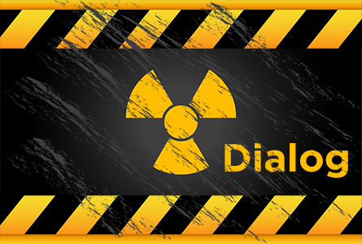

<p align="center">
  
  <br/><a href="https://cocoapods.org/pods/Dialog">
  
  
  
  
  <br/>
  
  
  <br/>
  
  
  
  </a>
</p>

# Introduction

## What's this?

`Dialog` is a delightful dialog view for iOS written in Swift.

## Requirements

* iOS 9.0+
* Xcode 8 with Swift 3

## Installation

#### CocoaPods

```ruby
pod 'Dialog'
```

## Contribution

You are welcome to fork and submit pull requests.

## License

`Dialog` is open-sourced software, licensed under the `MIT` license.

## Samples

#### Minimum Usage

```swift
let d = Dialog.alert(title: "Greetings", message: "Hi there! How's going?")
d.addAction(title: "Done", handler: { (dialog) -> (Void) in
    dialog.dismiss()
})
d.show(in: self)
```

#### Image & Actions

```swift
let d = Dialog.alert(title: "Dialog", message: "Check out my avatar!", image: #imageLiteral(resourceName: "avatar"))
d.rightToolStyle = { (button) in
    button.setImage(#imageLiteral(resourceName: "share"), for: .normal)
    button.tintColor = .lightGray
    return true
}
d.rightToolAction = { (button) in
    d.addAction(title: "Done", handler: { (dialog) -> (Void) in
        dialog.dismiss()
    })
}
d.addAction(title: "Add a Button", handler: { (dialog) -> (Void) in
    dialog.addAction(title: "Remove the Last Button", handler: { (dia) -> (Void) in
        dialog.removeAction(at: dia.actions.count - 1)
    })
})
d.show(in: self)
```

#### Loading

```swift
let d = Dialog.loading(title: "Logging in", message: "Please wait...", image: #imageLiteral(resourceName: "avatar"))
d.show(in: self)
DispatchQueue.main.asyncAfter(deadline: DispatchTime.now() + 3, execute: {
    d.dismiss()
})
```
